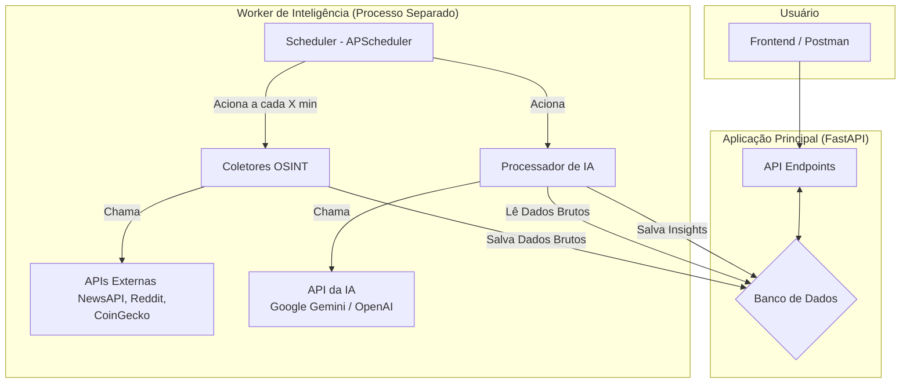

# Projeto de Controle de Investimentos com Inteligência OSINT & IA

Este não é apenas um sistema de controle de portfólio. É uma plataforma de inteligência de investimentos projetada para ir além do simples rastreamento de ativos, utilizando técnicas de **Open Source Intelligence (OSINT)** e **Análise por Inteligência Artificial** para gerar insights valiosos sobre criptomoedas e, futuramente, outros ativos.

O sistema coleta dados brutos de diversas fontes públicas, os processa com a ajuda de Grandes Modelos de Linguagem (LLMs) para extrair informações como sentimento, relevância e risco, e os armazena de forma estruturada para consulta e análise.

---

## ✨ Core Features

* **🔐 Autenticação Segura:** Sistema de login completo com JWT (JSON Web Tokens) para proteger os dados e endpoints do usuário.
* **📈 Monitoramento de Portfólio:** Acompanhamento do patrimônio do usuário e do histórico de operações simuladas.
* **⚡️ Dados em Tempo Real:** Conexão via WebSocket com provedores como Binance e Finnhub para obter preços de ativos em tempo real (funcionalidade base).
* **🧠 Pipeline de Inteligência (OSINT + IA):** O coração do projeto.
    * **Coleta de Dados Fundamentalistas:** Busca automática de perfis de ativos na CoinGecko para criar um "dossiê" base (links, ranking, descrição).
    * **Coleta Contínua de OSINT:** Workers em segundo plano monitoram fontes de notícias (NewsAPI) e redes sociais (Reddit, Twitter) 24/7.
    * **Processamento com IA:** Utiliza a API do Google Gemini (ou OpenAI) para analisar dados não estruturados (notícias, posts) e extrair:
        * Análise de Sentimento (Positivo, Negativo, Neutro).
        * Resumos Concisos dos Eventos.
        * Nível de Risco Associado.
        * Keywords Relevantes.
    * **Base de Conhecimento:** Armazena tanto os dados brutos coletados quanto os insights gerados pela IA em um banco de dados relacional.

---

## 🏛️ Arquitetura do Sistema

O projeto é construído com uma arquitetura desacoplada para garantir escalabilidade e eficiência. A coleta e processamento de dados ocorrem de forma assíncrona, sem impactar a performance da API principal.

---

## 🚀 Tecnologia Utilizada

* **Backend:** Python 3.11+
* **Framework:** FastAPI
* **Banco de Dados:** SQLModel (SQLAlchemy + Pydantic), PostgreSQL (PgAdmin4)
* **Tarefas em Background:** APScheduler
* **APIs de Dados:** PyCoinGecko, Finnhub stocks, Binance Criptos (por enquanto)
* **Inteligência Artificial:** Google Generative AI (Gemini)
* **Autenticação:** python-jose, passlib
* **Comunicação Real-time:** websockets

---

## 🗺️ Roadmap e Futuras Melhorias

* [ ] **Mais Fontes de OSINT:** Integrar com a API do X (Twitter) e GitHub para analisar a atividade da comunidade e dos desenvolvedores.
* [ ] **Análise de Sentimento Avançada:** Utilizar modelos de linguagem mais refinados para detectar nuances e sarcasmo.
* [ ] **Integração com Trading Real:** Conectar com APIs de corretoras (Alpaca para mercado americano, XP/BTG para B3) para executar ordens reais.
* [ ] **Sistema de Alertas:** Criar um sistema de notificações (via WebSocket ou email) para alertar o usuário sobre eventos críticos detectados pela IA.
* [ ] **Frontend:** Desenvolver uma interface web com dashboards interativos usando React ou Vue.js.

---

## 📄 Licença

Este projeto está sob a licença MIT. Veja o arquivo `LICENSE` para mais detalhes.

---
